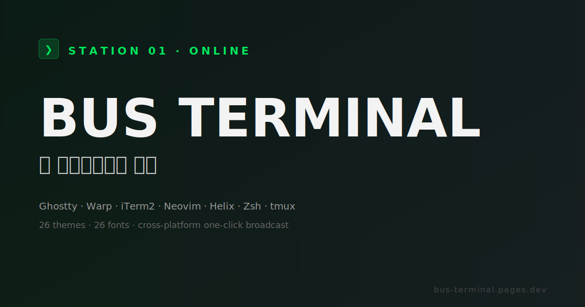

<div align="center">
  

  # BusTerminal

  **터미널, 에디터, 셸 설정을 시각적으로 조립하고 실제 config 파일로 내보내는 개발 환경 환승센터.**

  Ghostty · Warp · iTerm2 · Neovim · Helix · Zsh · tmux를 한 곳에서 다듬고,  
  내 손에 남는 설정 파일로 가져갑니다.

  <p>
    <a href="https://busterminal.dev"><strong>Live Demo</strong></a>
    ·
    <a href="https://busterminal.dev/guide">Guide</a>
    ·
    <a href="./docs/ROADMAP.md">Roadmap</a>
    ·
    <a href="https://github.com/Devguru-J/bus-terminal/issues/new">Feedback</a>
  </p>

  <sub>React 18 · TypeScript · Vite · Zustand · Supabase optional · MIT</sub>
</div>

<br />

<p align="center">
  
</p>

---

## BusTerminal이 해결하는 일

개발 환경은 대부분 텍스트 파일 몇 개로 이루어져 있습니다. 문제는 그 파일들이 모두 다른 문법을 쓴다는 점입니다.

- Ghostty는 `key = value`
- Warp는 theme YAML
- iTerm2는 `.itermcolors`와 Dynamic Profile JSON
- Neovim은 Lua
- Helix는 TOML
- Zsh는 shell script
- tmux는 자체 config 문법

BusTerminal은 이 차이를 하나의 작업 흐름으로 묶습니다.

1. **승강장을 고릅니다.** 지금 설정하려는 도구를 선택합니다.
2. **옵션을 만집니다.** 폰트, 색상, 키맵, 플러그인, 상태바, alias를 UI에서 조정합니다.
3. **미리 봅니다.** 변경 결과를 터미널/에디터 느낌으로 확인합니다.
4. **내보냅니다.** 실제 도구가 읽을 수 있는 config 파일로 다운로드합니다.

핵심은 단순합니다. BusTerminal은 설정을 대신 보관하는 서비스가 아니라, **좋은 설정 파일을 빠르게 만들기 위한 작업대**입니다.

---

## 왜 쓸 만한가

### Export-first

결과물은 데이터베이스에 갇히지 않습니다. `config`, `.zshrc`, `init.lua`, `.tmux.conf` 같은 평범한 파일로 나옵니다. dotfiles 저장소에 커밋해도 되고, 직접 고쳐도 되고, 다른 머신으로 옮겨도 됩니다.

### Local-first

로그인 없이 바로 사용할 수 있습니다. 기본 저장소는 브라우저 `localStorage`이며, Supabase 클라우드 동기화는 사용자가 연결했을 때만 켜집니다.

### 도구별 문법 존중

하나의 추상 설정을 억지로 모든 도구에 끼워 맞추지 않습니다. 각 승강장은 해당 도구가 실제로 이해하는 출력 형식을 기준으로 설계되어 있습니다.

### 환승하기

기존 설정이 있다면 붙여넣거나 업로드해서 가져올 수 있습니다. 인식한 값은 화면에 적용하고, 모르는 줄은 사용자가 확인할 수 있게 남깁니다.

### 일관된 시작점

처음 쓰는 사람도 길을 잃지 않도록 모든 플랫폼 페이지에 3단계 안내가 있습니다. 어떤 도구든 "선택 → 조정 → 내보내기" 흐름은 같습니다.

---

## 지원 플랫폼

| 승강장 | 설정할 수 있는 것 | 가져오기 | 내보내기 |
|---|---|---|---|
| **Ghostty** | 폰트, 색상, 창 여백, 커서, 키바인딩, expert 옵션 | Ghostty config snippet | `~/.config/ghostty/config` |
| **Warp** | 테마, 터미널 색상, 폰트, 워크플로우, AI 옵션 | Warp theme YAML | `~/.warp/themes/*.yaml` |
| **iTerm2** | 프로파일, 폰트, 창 투명도, ANSI 팔레트, 핫키 윈도우 | `.itermcolors` | `.itermcolors`, Dynamic Profile JSON |
| **Neovim** | 기본 옵션, UI, 컬러스킴, lazy.nvim 플러그인, LSP, 키맵 | `init.lua` 일부 파싱 | `~/.config/nvim/init.lua` |
| **Helix** | 테마, editor 옵션, LSP, file picker, keymap | `config.toml`, `languages.toml` 일부 파싱 | `config.toml`, `languages.toml` |
| **Zsh** | 프롬프트, 히스토리, 플러그인, alias, PATH, env, completion | `.zshrc` 일부 파싱 | `~/.zshrc`, optional `starship.toml` |
| **tmux** | prefix, 상태바, pane/window 동작, TPM 플러그인, 키바인딩 | `.tmux.conf` 일부 파싱 | `~/.tmux.conf` |

> Import는 플랫폼별로 지원 범위가 다릅니다. 현재는 안전한 범위 안에서 값을 인식하고, 확실하지 않은 줄은 사용자가 직접 검토할 수 있게 남기는 방향입니다.

---

## 주요 기능

### Visual config builder

폼, 토글, 슬라이더, 색상 입력으로 설정을 조립합니다. config 문법을 외우기 전에 먼저 결과를 만져볼 수 있습니다.

### Theme transfer center

Tokyo Night, Catppuccin, Gruvbox, Nord, Solarized 계열을 포함한 26개 테마를 탐색하고 비교합니다. 선택한 테마는 여러 도구의 색상 설정으로 환승할 수 있습니다.

### Font center

개발자용 폰트를 미리 보고, 터미널/에디터 설정에 반영합니다. 폰트는 취향이 아니라 가독성의 일부라서 별도 센터로 다룹니다.

### Route storage

완성한 설정 조합은 "노선"으로 저장할 수 있습니다. 로컬 보관이 기본이며, 계정을 연결하면 선택한 스냅샷을 클라우드에 보관할 수 있습니다.

### Diff and diagnostics

내보내기 전에 기본값과의 차이, 잠재 충돌, 누락된 선택을 점검합니다. 다운로드 직전에 한 번 더 볼 수 있는 출발 전 점검판입니다.

### Install script

고급 사용자를 위해 선택한 파일을 대상 경로에 배치하는 shell script를 생성합니다. 기본 흐름은 여전히 수동 다운로드와 직접 적용입니다.

---

## 작동 방식

```txt
┌─────────────────────────────────────────────────────────┐
│ React UI                                                │
│ 승강장 · 환승센터 · 폰트센터 · 출발 전 점검              │
├─────────────────────────────────────────────────────────┤
│ Zustand stores                                          │
│ 플랫폼별 독립 상태 + localStorage persistence           │
├─────────────────────────────────────────────────────────┤
│ Parsers / serializers                                   │
│ 기존 설정 가져오기 + 플랫폼별 native config 출력         │
├─────────────────────────────────────────────────────────┤
│ Optional cloud sync                                     │
│ Supabase auth/snapshots, 연결하지 않으면 완전 로컬 동작   │
└─────────────────────────────────────────────────────────┘
```

설정 생성 로직은 가능한 한 순수 함수에 가깝게 유지합니다. UI가 바뀌어도 serializer 테스트가 통과하면 출력 파일의 기본 신뢰도를 지킬 수 있습니다.

---

## 빠른 시작

### 요구 사항

- Node.js 20 이상 권장
- npm, bun, pnpm, yarn 중 하나

### 로컬 실행

```bash
npm install
npm run dev
```

브라우저에서 `http://localhost:5173`을 엽니다.

### 빌드

```bash
npm run build
npm run preview
```

### 테스트

```bash
npm run lint
npm run test
```

`bun`을 쓴다면 같은 스크립트를 `bun run dev`, `bun run build`, `bun run test`처럼 실행하면 됩니다.

---

## 환경 변수

BusTerminal은 환경 변수가 없어도 로컬 도구로 동작합니다. 아래 값은 선택 기능을 켤 때만 필요합니다.

```bash
VITE_SUPABASE_URL=
VITE_SUPABASE_ANON_KEY=
VITE_PLAUSIBLE_DOMAIN=
```

- `VITE_SUPABASE_URL`, `VITE_SUPABASE_ANON_KEY`: 로그인과 클라우드 스냅샷
- `VITE_PLAUSIBLE_DOMAIN`: Plausible 이벤트 분석

배포 환경에서는 Google Tag Manager와 Cloudflare Web Analytics를 함께 사용할 수 있도록 CSP가 설정되어 있습니다.

---

## 프로젝트 구조

```txt
src/
  components/     공통 UI, shell, platform helper
  data/           테마, 폰트, preset, 플랫폼 option catalog
  lib/            parser, serializer, diagnostics, analytics
  pages/          Home, Guide, 플랫폼 승강장, Export, Settings
  stores/         Zustand stores

public/
  logo.png
  og.svg
  _headers
  sitemap.xml

docs/
  ROADMAP.md
  SUPABASE.md
  CHANGELOG.md
  SUGGESTIONS.md
```

---

## 원칙

### 파일이 최종 산출물입니다

BusTerminal의 목적은 사용자를 앱 안에 묶는 것이 아닙니다. 좋은 설정을 만들고, 그것을 사용자가 소유하는 파일로 넘겨주는 것이 목적입니다.

### 기존 설정을 함부로 덮어쓰지 않습니다

앱은 다운로드 가능한 파일을 생성합니다. 실제 적용, 백업, merge는 사용자가 명시적으로 결정합니다.

### 브랜드 언어는 쓰되, 기능은 분명하게 설명합니다

승강장, 환승하기, 차고 보관, 출발권 같은 메타포를 유지하지만, 각 화면에는 실제 의미를 같이 적습니다.

### 하나의 도구를 기준으로 삼지 않습니다

Ghostty, Warp, iTerm2, Neovim, Helix, Zsh, tmux는 모두 같은 레벨의 승강장입니다. 사용자는 자기 도구에서 시작하면 됩니다.

---

## 로드맵

자세한 계획은 [docs/ROADMAP.md](./docs/ROADMAP.md)를 확인하세요.

현재 우선순위는 다음과 같습니다.

- import 파서 안정화와 커버리지 확대
- export 이후 적용 안내 강화
- route snapshot 복원 UX
- 갤러리/공유 노선 실험
- i18n 기반 정리

---

## 기여

기여는 작고 검증 가능한 단위가 가장 좋습니다.

1. Issue를 열어 변경 의도와 영향을 짧게 공유합니다.
2. 기능 변경은 가능한 한 한 플랫폼 또는 한 흐름에만 집중합니다.
3. parser/serializer 변경에는 Vitest 케이스를 추가합니다.
4. UI 변경은 모바일과 데스크톱에서 확인합니다.
5. PR 전에 아래 명령을 실행합니다.

```bash
npm run lint
npm run test
npm run build
```

좋은 첫 기여 후보:

- 플랫폼별 import 인식 범위 확대
- 테마/폰트 큐레이션 보강
- README와 Guide의 영어 버전
- 설정 적용 후 OS별 배치 안내
- 접근성 점검과 키보드 흐름 개선

---

## License

[MIT](./LICENSE)
